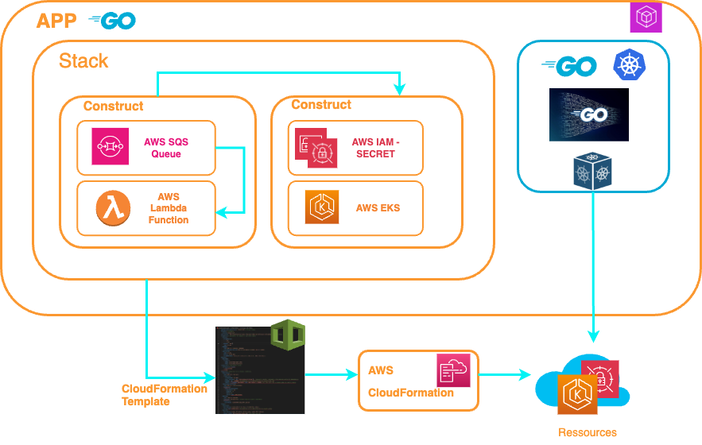

  

The purpose of this tutorial is to guide you through the various steps involved in deploying sonarqube and a java application in an AWS EKS environment using AWS Cloud Development Kit (AWS CDK and AWS SDK) for golang.
The java application will be stored in AWS CodeCommit and will use CodeBuild integrated with sonarqube (for code analysis) for production release .

But you can adapt it and deploy your own application.
You can, for example, create your VPC (if you don't have one), deploy your EKS cluster (same thing if you don't have one) and deploy the AWS CI/CD

The AWS CDK lets you build reliable, scalable, cost-effective applications in the cloud with the considerable expressive power of a programming language.
A CloudFormation template is generated for each deployment.




My regret is not to have been able to do everything with the CDK and have a complete CloudFormation stack due to the lack of knowledge and the documentation of the AWS CDK which is really very poor, but I do not lose hope of getting there.😀


## Workload


1. **Existing Java application : Your team has an existing Java application, which it is currently deploying and which has code quality problems.They use a Git repository (AWS CodeCommit) for version control.
2. **AWS EventBridge: it automatically creates an event bus to which events are routed.It detects whether it's a commit event or a Pull Request and sends the event to CodePipline.
3. **AWS CodePipeline: it models the entire publishing process for creating your code, deploying it to pre-production environments, testing your application and launching it into production by triggering a CodeBuild event.
4. **AWS CodeBuild: With CodeBuild, you don't need to commission, manage or scale your generation servers. This service provides pre-packaged generation environments for commonly used programming languages and generation tools. In our case, we'll be using a JAVA environment with Maven. 
5. **Clean Code: We trigger a SonarQube analysis if the Quality Gates applied to our project passed, we go on to the production stage if the build fails and we generate an event in AWS CloudWatch and we can see the analysis of our code in SonarQube.
6. **Quality Gate passed : build a Docker image of our application.
7. **Quality Gate passed : upload our application Docker image to AWS ECR.
8. **Deploying our application in our EKS cluster

## Prerequisites

Before you get started, you’ll need to have these things:

* AWS account
* [SSO Login](https://docs.aws.amazon.com/cli/latest/userguide/sso-configure-profile-token.html)
* [AWS CLI V2](https://docs.aws.amazon.com/cli/latest/userguide/getting-started-install.html)
* [AWS Cloud Development Kit (AWS CDK) v2](https://docs.aws.amazon.com/cdk/v2/guide/getting_started.html)
* [Go language installed](https://go.dev/)
* [Node.jjs installed](https://nodejs.org/en)
* [Kubectl installed](https://docs.aws.amazon.com/eks/latest/userguide/install-kubectl.html) is a command line tool that you use to communicate with the Kubernetes API 
server.
* A Git Client
* [AWS git-remote-codecommit](https://docs.aws.amazon.com/codecommit/latest/userguide/setting-up-git-remote-codecommit.html) Git extension. This will be used to authenticate requests to the repo
* [eksctl installed](https://eksctl.io/installation/) 
* bash version 4+

When setting up a new AWS environment for our project, one of the first things you'll need to do is create a VPC.
When setting up the VPC, it is essential to configure security groups to control inbound and outbound traffic to and from the VPC. Security groups act as virtual firewalls, allowing only authorized traffic to pass through.
The ports to be authorized (defined in the Security Groups) for input/output are : 9000 (sonarqube default port)

## Steps

### ✅ Set Config AWS Profil

The `config_crd.json` Contains the parameters to be initialized to AWS Profil 

```
config_crd.json :

Region:  Deployment region	        
Account: AWS account number
SSOProfile: AWS SSO Profile using
Index: Number to generate a name for the VPC, EKS Cluster,AWS Secret, Stacks .... :
      <NAME+INDEX>
AWSsecret: AWS Secret name for sonarqube 
```    
❗️ You must initialize these variables with your informations.

### ✅ Creating a VPC

If you already have VPC to create you can skip this step.</br>
❗️ Before deploying your EKS cluster you must check that your 
Private subnet has the tag: 
* ✨ kubernetes.io/role/internal-elb=1 

and you Public subnet the tag:
* ✨ kubernetes.io/role/elb=1

Please see [subnet requirements and considerations](https://docs.aws.amazon.com/eks/latest/userguide/network_reqs.html)

go to directory [VPC](vpc) (please read the README.md)

### ✅ Creating a EKS Cluster
go to directory [EKS](eks) (please read the README.md)

### ✅ SonarQube deployment
go to directory [sonarqube](sonarqube) (please read the README.md)

### ✅ CI/CD for Amazon EKS
go to directory [devops](devops) (please read the README.md)

### ✅ Amazon EventBridge
go to directory [eventbridge](eventbridge) (please read the README.md)

---

## ✅ Conclusion

In conclusion, this tutorial has walked you through the comprehensive process of deploying SonarQube and a Java application in an AWS EKS environment, utilizing the powerful combination of AWS Cloud Development Kit (AWS CDK) and AWS SDK for Golang. By following the step-by-step guide, you have gained insights into setting up a robust development and deployment pipeline that includes AWS CodeCommit for version control, CodeBuild for building your Java application, and seamlessly integrating SonarQube for thorough code analysis to ensure the highest code quality.

Deploying applications on AWS EKS provides scalability, reliability, and the flexibility to manage containerized workloads efficiently. Leveraging AWS CDK and AWS SDK for Golang streamlines the infrastructure as code (IaC) process, making it easier to define and provision resources in the AWS environment.

By integrating SonarQube into your CI/CD pipeline, you have added a critical layer of code quality assurance. This allows you to identify and address potential issues early in the development process, leading to more robust and secure applications in production.

---


## ✅ Clean Up AWS resources

For clean up platform please run this command :

```bash 
aws-cicd:>./resetws.sh

```

This script clean up all deployed components except the VPC. If you want to destroy the vpc, execute the following commands :

```bash 
aws-cicd:>cd vpc
aws-cicd:/vpc> cdk destroy --force

```

If you want to uninstall one particular component, you have in each step the instruction .

---

## ✅ Next step

At this stage, the sonarqube deployment provides a public ip address in http and a non ssl communication between the database, in a next step I will do the integration in a dns domain and a https access with certificate and a SSL communication between the database.And integration of the eventbridge stage into the devops stack

---

## ✅ Ressources

▶️ [awscdk go package](https://pkg.go.dev/github.com/aws/aws-cdk-go/awscdk/v2#section-readme) 

▶️ [awseks go package](https://pkg.go.dev/github.com/aws/aws-cdk-go/awscdk/v2/awseks#section-documentation)

▶️ [awsiam go package](https://pkg.go.dev/github.com/aws/aws-cdk-go/awscdk/v2@v2.102.0/awsiam#section-readme)

▶️ [awsec2 go package](https://pkg.go.dev/github.com/aws/aws-cdk-go/awscdk/v2/awsec2#section-readme)

▶️ [Amazon EKS VPC and subnet requirements and considerations](https://docs.aws.amazon.com/eks/latest/userguide/network_reqs.html)

▶️ [eventbridge go package](https://pkg.go.dev/github.com/aws/aws-sdk-go-v2/service/eventbridge)

▶️ [codebuild go package](https://pkg.go.dev/github.com/aws/aws-sdk-go-v2/service/codebuild)

▶️ [cloudformation go package](https://pkg.go.dev/github.com/aws/aws-sdk-go-v2/service/cloudformation)
