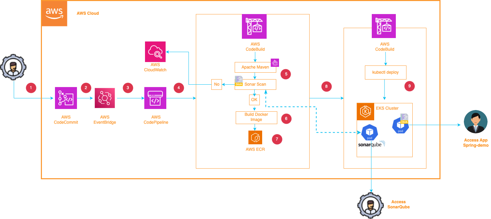
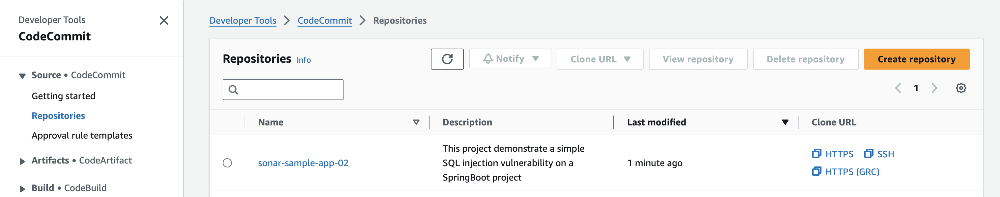
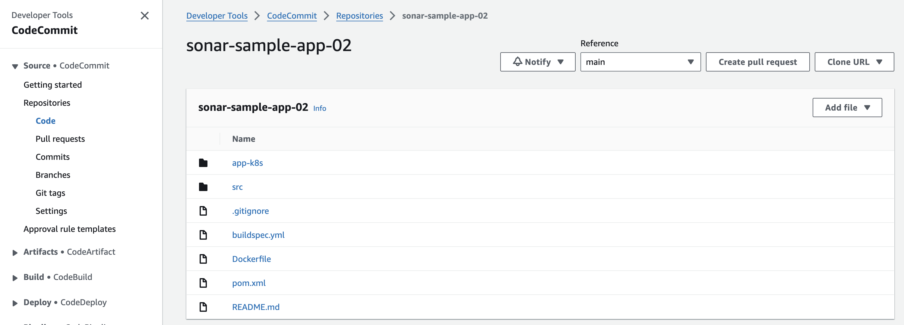
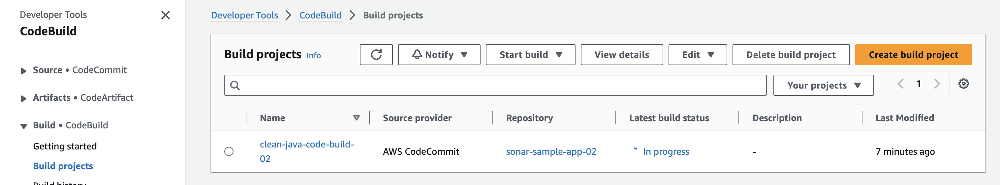
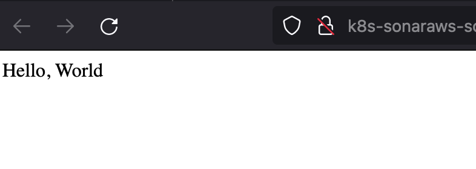
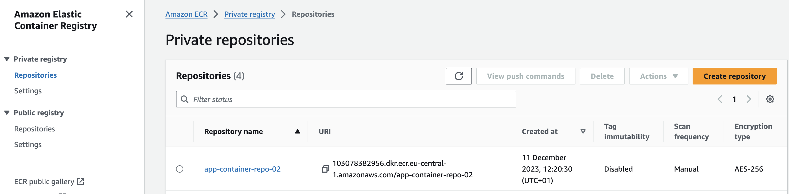

 


# Welcome to your CDK Deployment with Go.

The purpose of this deployment is to configure a AWS DevOps environment:
- Creating the **sonar-sample-app** CodeCommit repository
- Push a sampls Java application in CodeCommit repository
- Creating a repository for container images
- Define the build configuration with AWS CodeBuild
- Modify IAM permissions for CodeBuild
- Allow CodeBuild to deploy to the EKS cluster
- Setup CodePipeline



* The `cdk.json` file tells the CDK toolkit how to execute your app.
* The `config.json` Contains the parameters to be initialized to deploy the task :
```
Config.json :

Reponame:     CodeCommit repository name : sonar-sample-app
Desc:         Repository description
GitRepo:      Repository source to be pushed into codecommit
Recr:         Repository name for container images : app-container-repo
ImgTag:       Image TAG : Latest
BuildPr:      Build project name : clean-java-code-build
PiplineN:     Pipline name
ClusterName   ClustWorkshop
EksAdminRole  AdminRole name
Platform      x86
```    
❗️ Do not change these values (for this deployment), just the cluster name or **Platform** if you run a eks cluster on ARM set Platform value at **arm**

But you can deploy your own application, you'll need to change the source of your application's repository (**GitRepo** entry) in config.json and respect the following variables in your *buildspec.yml* file :
* SONAR_TOKEN
* SONAR_HOST_URL
* SourceBranch"`
* DestinationBranch
* IMAGE_REPO_NAME
* IMAGE_TAG
* EKS_CLUSTER_NAME
* EKS_NS_APP"`
* EKS_CODEBUILD_APP_SVC
* EKS_DEPLOY_APP
* EKS_ROLE
* SONAR_PROJECT
* PRKey

The *buildspec.yml* file used for this deployment is located in the **build** directory.
You should also create an **app-k8s** directory containing your application deployment files.

## Useful commands

 * `./cdk.sh deploy`  deploy this stack to your default AWS account/region
 * `./cdk.sh destroy` cleaning up stack

## ✅ Setup Environment

Run the following command to automatically install all the required modules based on the go.mod and go.sum files:

```bash
aws-cicd:/devops/> go mod download
```

## ✅ Run deployment

When you’re ready, run **cdk.sh deploy**

```bash
aws-cicd:/devops/> ./cdk.sh deploy
Do you wish to deploy these changes (y/n)? y
DevopsStack02: deploying... [1/1]
DevopsStack02: creating CloudFormation changeset...

 ✅  DevopsStack02

✨  Deployment time: 53.52s

Outputs:
DevopsStack02.ARNRoleBuildProject = arn:aws:iam::xxxxxxx:role/BuildAdminRole02
Stack ARN:
arn:aws:cloudformation:eu-central-1:xxxxxxxx:stack/DevopsStack02/f3f9ee40-82f7-11ee-b2ac-0a0f9710d577

✨  Total time: 57.11s

✅ CodeCommit repository created successful.
✅ Successfully updated EKS Admin Role.
🕒 Update ConfigMap EKS ...Stack Outputs:
✅ Successfully updated aws-auth ConfigMap.
✅ Clone GitHub App Java Demo is successful.
✅ Commit : M  buildspec.yml
✅ Modify buildspec.yaml is successful.
✅ Push Repository in CodeCommit Repository is successful.

aws-cicd:/devops/>
``` 

On your AWS management console, you can now see your repository (go in CodeCommit console):


It was populated :


After the code push to the repository a first build is triggered:


After a few minutes the build has a successful status, your application is deployed on the EKS cluster.😀

A new name space is created : sonar-aws-javaapp-ns
You can check with the following command :

```bash
aws-cicd:/devops/> kubectl get ns sonar-aws-javaapp-ns
Name                   Status     Age
sonar-aws-javaapp-ns   Active      3m
aws-cicd:/devops/>
```

You can check that your application has been deployed correctly with the following command:

```bash
aws-cicd:/devops/> kubectl get all -n sonar-aws-javaapp-ns
NAME                                            READY   STATUS    RESTARTS   AGE
pod/sonar-aws-javaapp-deploy-5dc978947b-b6m9k   1/1     Running   0          5m

NAME                            TYPE           CLUSTER-IP      EXTERNAL-IP                  PORT(S)          AGE
service/sonar-aws-javaapp-svc   LoadBalancer   10.100.41.213   k8s-sonarxxx.amazonaws.com   8080:32110/TCP   5m

NAME                                       READY   UP-TO-DATE   AVAILABLE   AGE
deployment.apps/sonar-aws-javaapp-deploy   1/1     1            1           5m

NAME                                                  DESIRED   CURRENT   READY   AGE
replicaset.apps/sonar-aws-javaapp-deploy-5dc978947b   1         1         1       5m
aws-cicd:/devops/>
```

😀  Now you can connect to the Application instance at the following url sample (take EXTERNAL-IP service and port of the application):  
   
 http://k8s-sonarxxx.amazonaws.com:8080

 

You can also go to ECR (Elastic Container Registry) to check the creation of your repository, which contains the docker image generated during the build(go to ECR console):
 


The last step is to set up an eventbridge rule that will be triggered by each Pull Request.


-----
<table>
<tr style="border: 0px transparent">
	<td style="border: 0px transparent"> <a href="../sonarqube/README.md" title="SonarQube deployment">⬅ Previous</a></td><td style="border: 0px transparent"><a href="../eventbridge/README.md" title="EventBridge rule">Next ➡</a></td><td style="border: 0px transparent"><a href="../README.md" title="home">🏠</a></td>
</tr>
<tr style="border: 0px transparent">
<td style="border: 0px transparent">SonarQube deployment</td><td style="border: 0px transparent">EventBridge rule</td><td style="border: 0px transparent"></td>
</tr>

</table>