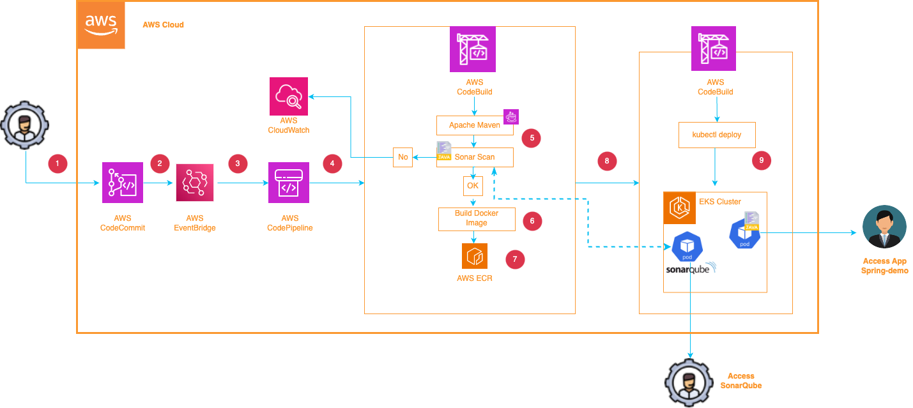

 

# Welcome to your CDK Deployment with Go.

In a fast-moving software development process, we want to get feedback on code quality as early as possible. Traditionally this would require pushing code into a CI/CD pipeline and waiting for various analysis and test stages to complete. By using Sonar's Pull Request (PR) analysis feature we can shorten the feedback-cycle for developers. Everytime a developer commits code in a PR, we want Sonar scanning to be triggered.



The purpose of this deployment is to configure an Amazon EventBridge rule to enable the previously described workflow.
- Creating a EventBridge Role
- Creating a EventBridge Rule


## Useful commands

 * `./cdk.sh deploy`  deploy this stack to your default AWS account/region
 * `./cdk.sh destroy` cleaning up stack

## ✅ Setup Environment

Run the following command to automatically install all the required modules based on the go.mod and go.sum files:

```bash
aws-cicd:/eventbridge/> go mod download
```

## ✅ Run deployment

When you’re ready, run **cdk.sh deploy**

```bash
aws-cicd:/eventbridge/> ./cdk.sh deploy

✅  EventBridge Rule ARN  'arn:aws:events:eu-central-1:xxxxxxxx:rule/OnPullRequestSonarTrigger' created successfully

aws-cicd:/eventbridge/>

``` 

<h1>Congratulations on successfully completing this tutorial. 👏</h1>

<table class="table" style="font-size: 14px;">
<tr style="border: 0px transparent">
	<td style="border: 0px transparent;width:50%;"><h1 style="font-size:100px;">Tank You</h1> </td><td style="border: 0px transparent"></td>
</tr>

</table>


-----
<table>
<tr style="border: 0px transparent">
	<td style="border: 0px transparent"> <a href="../devops/README.md" title="CI/CD for Amazon EKS">⬅ Previous</a></td><td style="border: 0px transparent"><a href="../README.md" title="home">🏠</a></td>
<tr style="border: 0px transparent">
<td style="border: 0px transparent">SonarQube deployment</td><td style="border: 0px transparent"></td>
</tr>

</table>
