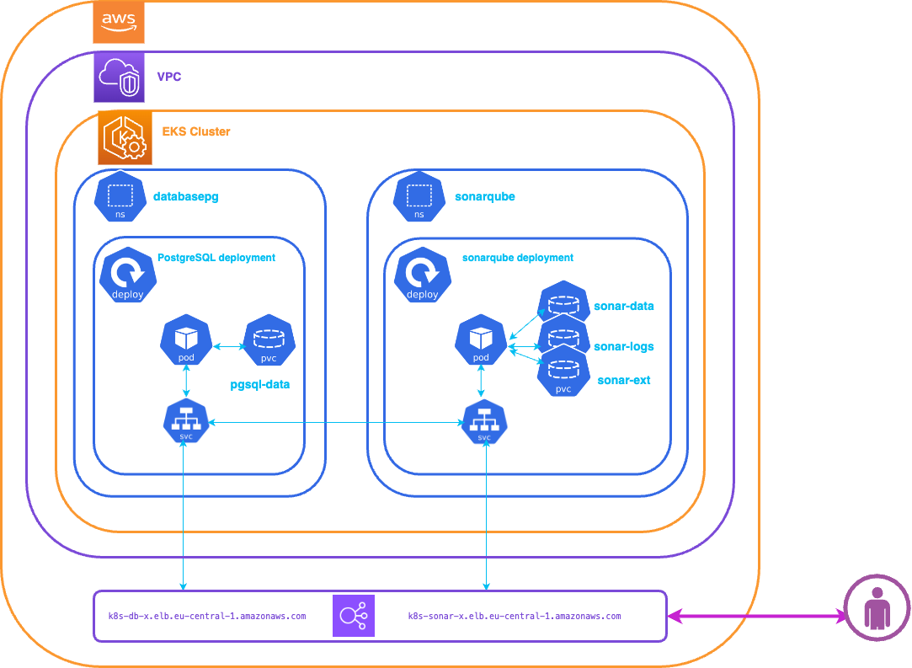
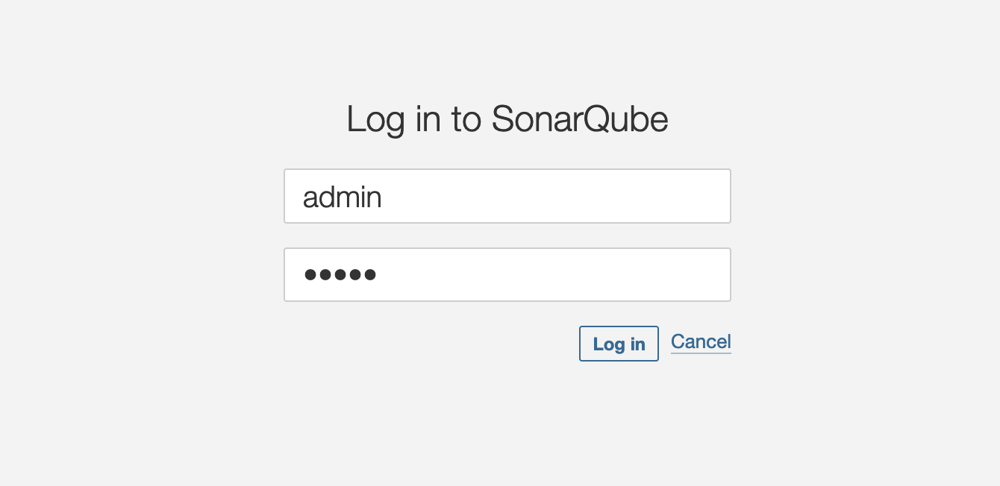

 


# Welcome to your SonarQube Deployment with Go.

The purpose of this deployment is to deploy SonarQube in EKS Cluster.




* The `config.json` Contains the parameters to be initialized to deploy the task :
```
Config.json :

ClusterName:    EKS Cluster Name
NSDataBase:     K8s Namespace for PostgreSQL database (databasepg)
PvcDBsize:      PVC size for Database storage
PGSecret:       K8s manifest file for database secret (dist/pgsecret.yaml)
NSSonar:        K8s Namespace for SonarQube     
PvcSonar:       K8s manifest file for PVC SonarQube  
StorageClass:   Name of k8s storage class (managed-csi)
Sonaruser:      Sonarqube DB user (sonarqube)
Sonarpass:      Sonarqube DB user password (Bench123)
PGsql:		    K8s manifest file for deployment PostgreSQL database (dist/pgsql.yaml)
PGconf      	K8s manifest file for Configmap PostgreSQL database (dist/pgsal-configmap.yam)
DepSonar        K8s manifest file for deployment SonarQube (dist/sonarqube.yaml)
SonarSVC        SonarQube k8s service
SonarPort       Default port for sonarqube : 9000
SonarTransport  Default access : http:// 
SonarTagImage   Sonar docker image tag : community, developer, enterprise
```    
> For this deployment, we won't be using AWS CDK, which would require us to install several Lambda functions to interact with our EKS cluster.We will use the go-client module to interact with our cluster.

All manifest files required for deployment are in directory: **dist**

Two namespaces will be created:
- sonarqube: for sonarqube instance
- databasepg : for postgresql database instance

By default this deployment deploys the community edition of sonarqube, if you want to deploy another version please modify the SonarTagImage in the config file : **cinfig.json** 


## Prerequisites

Before you get started, you’ll need to have these things:

✅ An EKS Cluster runnig and configured

✅ Previous deployment steps are completed

## What does this task do?

- Create a k8s namespace for PostgreSQL database
- Create secret and configmap for PostgreSQL database
- Create a PVC for PostgreSQL database
- Deployment PostgreSQL database
- Create a k8s namespace for SonarQube
- Create secret for SonarQube Database connexion
- Create a PVCs for SonarQube
- Deployment SonarQube
- Config SonarQube : UPDATE Lisence
- Generated a SonarQube Token for for analysis
- Create a AWS Secret : prod1/sonarqube/workshop{index}

## Useful commands

 * `./cdk.sh deploy`      deploy this stack to your default AWS account/region
 * `./cdk.sh destroy`     cleaning up stack


## ✅ Setup Environment

Run the following command to automatically install all the required modules based on the go.mod and go.sum files:

```bash
aws-cicd:/sonarqube/> go mod download
``` 

## ✅ Deploying SonarQube

Let’s deploy a SonarQube! When you’re ready, run **./cdk.sh deploy**

```bash
aws-cicd:/sonarqube> ./cdk.sh deploy
Deployment PostgreSQL Database :  Creating namespace... 
✅ Namespace databasepg1 created successfully
Deployment PostgreSQL Database :  Creating PVC... 
✅ PVC Database : pgsql-data created successfully

Deployment PostgreSQL Database :  Creating secret database... 
✅ Database secret created successfully

Deployment PostgreSQL Database :  Creating ConfigMap Init DB... 
✅ PGSQLInit configMaps created successfully

Deployment PostgreSQL Database :  Creating ConfigMap DATA DB... 
✅ PGSQLData configMaps created successfully

Deployment PostgreSQL Database :  Deploy Postgresql deployment... 

✅ PostgreSQL Database Successful deployment External IP: k8s-database-postgres-20070ddde0-8cc1726b907c1328.elb.eu-central-1.amazonaws.com
✅ JDBC URL : jdbc:postgresql://postgres-service.databasepg1.svc.cluster.local:5432/sonarqube?currentSchema=public - IP : 10.100.194.203

Deployment SonarQube :  Creating namespace... 
✅ Namespace sonarqube1 created successfully
Deployment SonarQube :  creating PVCs... 
✅ SonarQube PVCs created successfully
Deployment SonarQube :  Creating sonar k8s secret... 
✅ SonarQube k8s Secret for Database created successfully : sonarsecret
Deployment SonarQube :  Updating sonarqube image tag... 
Deployment SonarQube :  Deployment SonarQube POD... 
✅ SonarQube Pod Successful deployment
Deployment SonarQube :  Deployment SonarQube Service... 
✅ SonarQube Service Successful deployment
Deployment SonarQube :  Waiting SonarQube Service up... 

✅ SonarQube deployment created successfully - External Connexion: http://k8s-sonarqub-sonarqub-978759451d-48b6d0f821b8fe16.elb.eu-central-1.amazonaws.com:9000
✅ SonarQube deployment created successfully 😀

✅ DNS resolution for Database service is successful.
Generated SonarQube Token : Creating Token... 
✅ Token creation successful : SONAR_TOKEN= sqa_a36764cb5b5adceb1dad61ad1b7bf0cded6bb090
Generated SonarQube Token : Add Token in AWS Secret... 
✅ AWS Secret created successfully: prod1/sonarqube/workshop02


``` 

You'll have to wait a few minutes for the External address to be bindered by DNS.It is the step : **DNS resolution for Database service**

We can check if SonarQube is deployed :
```bash 
aws-cicd:/sonarqube> kubectl get pods -n sonarqube
NAME                        READY   STATUS    RESTARTS   AGE
sonarqube-7c66dfc757-p9sth   1/1     Running   0         1m56s
``` 

We can check if SonarQube service running :

```bash 
aws-cicd:/sonarqube> kubectl get pods -n sonarqube
NAME                        TYPE           CLUSTER-IP     EXTERNAL-IP              PORT(S)          AGE
service/sonarqube-service   LoadBalancer   10.X.X.X       k8s-sonarqub-xxxx.com   9000:30621/TCP   3m17s
```    
       
😀  Now you can connect to the SonarQube instance at the following url sample:  
   
 http://k8s-sonarqub-xxxx.com:9000

 

Default admin credentials
When installing SonarQube, a default user with Administer System permission is created automatically:

* Login: admin
* Password: admin

-----
<table>
<tr style="border: 0px transparent">
	<td style="border: 0px transparent"> <a href="../eks/README.md" title="Creating a EKS Cluster">⬅ Previous</a></td><td style="border: 0px transparent"><a href="../devops/README.md" title="CI/CD for Amazon EKS">Next ➡</a></td><td style="border: 0px transparent"><a href="../README.md" title="home">🏠</a></td>
</tr>
<tr style="border: 0px transparent">
<td style="border: 0px transparent">Creating a EKS Cluster</td><td style="border: 0px transparent">CI/CD for Amazon EKS</td><td style="border: 0px transparent"></td>
</tr>

</table>
